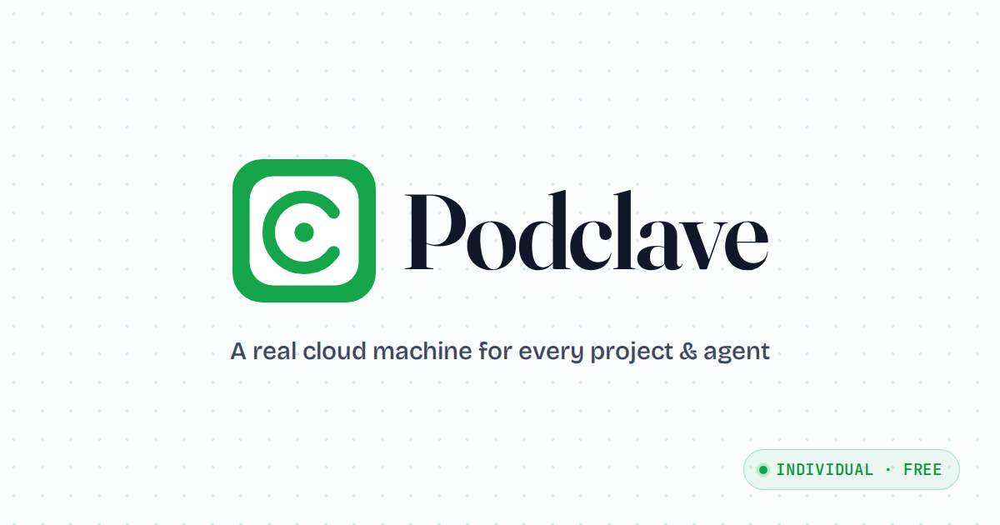

### A real cloud machine for every project & agent.

Your idea shouldn't wait on setup. You bring Claude, GitHub, and a cloud
account; we build the **control plane** that turns them into a fully-loaded,
isolated machine for any project — ready in seconds, reachable from any
device, and still working after you close the tab.

<a href="https://podclave.com"><strong>podclave.com&nbsp;→</strong></a>

---

## ◉ Podclave — the flagship

**A control plane for renting and managing [Sprites.dev](https://sprites.dev) sandboxes, opinionated for AI-assisted development. Claude Code first.** Sign in, connect a Sprites.dev org, click **+ Sprite**, and you have a real Linux box in seconds — reachable from your phone, with `claude` pre-logged-in and `gh` pre-authed. A real environment, not a toy: your agents run with your full kit and can actually run commands to check their work instead of guessing.

**BYOFly — your accounts, your machines, your root.** Each Sprite lives in your Sprites.dev org and pays Fly directly. We build the platform; you own the boxes. No resold compute, no markup, no metered overage.

- **A workstation in your browser** — PTY shell, file management (upload/download), and a per-Sprite control page from any device, phone and Chromebook included. Close the tab, reopen on another device, your shell comes back.
- **Your full kit, already loaded** — every new Sprite arrives with `claude` installed, a seeded `CLAUDE.md`, and an in-Podclave skill so sessions know they're managed. Credentials you save once at the account or org level land on every box.
- **Send a task and walk away** — fire a background Claude session from the control page; it keeps working after you close the tab and surfaces in Anthropic's native Remote Control. The Sprite stays warm while a task is live, sleeps when it's done.
- **Real services + a live preview URL** — run Postgres/Redis/etc. as managed services and route the Sprite's public HTTPS URL to any of them.
- **Schedules, Scouts & Agent Email** — cron across your Sprites in the free base; on a team, add Scouts (unattended Claude on a schedule or webhook) and Agent Email (real inboxes assigned to your boxes).
- **Built for one. Fleet-ready.** — invite teammates who never touch the Fly token, set one network-egress policy plus package and overlay baselines once, inherited fleet-wide, with an admin console over the whole fleet.

**Pricing — one plan to start; pay when you bring a team.**

- **Individual — Free.** The full control plane for your own projects, plus Schedules.
- **Team — from $99/mo.** Up to 10 members (add more in blocks of 10), plus Scouts and Agent Email.
- **Enterprise — Custom.** Flat pricing, SSO, invoicing, security review.

Either way the compute is your own Fly bill — no markup, no metered overage.

**[Get started at podclave.com →](https://podclave.com)** &nbsp;·&nbsp; Individual is free.

---

## ◉ [`know`](https://github.com/podclave/know) — open source

**A small, self-hosted team brain** — shared, durable memory for everyone's Claude. Ask a question and **recall** returns what the team has learned; learn something durable and your Claude **saves** it. A server-side secretary keeps it organized.

The whole thing is a git repo of one-fact-per-file markdown — **git is the truth** — wrapped in an MCP-over-HTTP server you connect to as a single URL. No vector DB; just git + markdown + a cheap `claude` agent. We build it in the open, and run it ourselves.

→ **[github.com/podclave/know](https://github.com/podclave/know)**

---

[podclave.com](https://podclave.com) &nbsp;·&nbsp; [`know`](https://github.com/podclave/know) &nbsp;·&nbsp; Built on [Sprites.dev](https://sprites.dev) + [Fly.io](https://fly.io)

